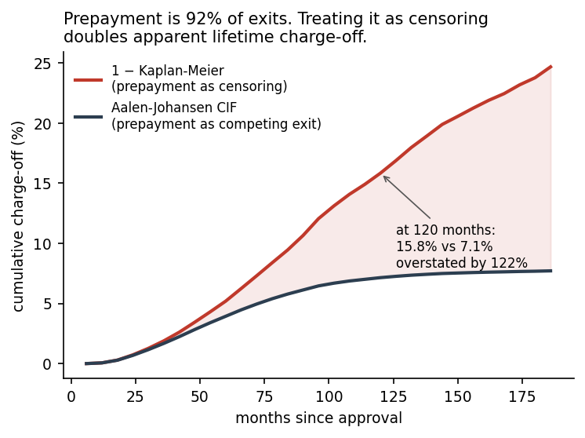
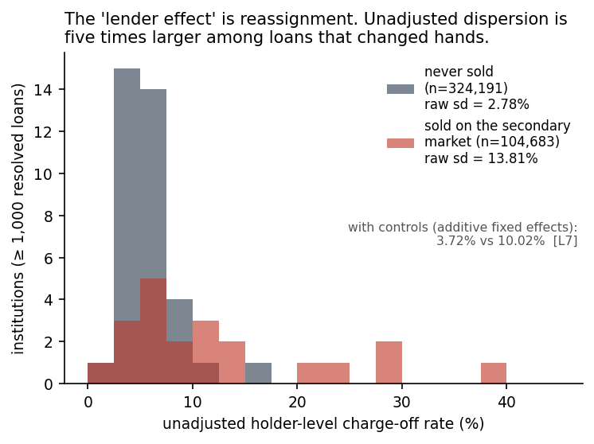

# What the SBA 7(a) loan file can and cannot tell you

[](https://github.com/matthewgg22/SBA/actions/workflows/test.yml)

`BankName` is not the originating lender.

SBA's own data dictionary defines it as the bank the loan is *currently assigned to*.[^dd] So every
cross-lender performance comparison built on this file — and there are many — measures who ended
up **holding** the paper after sixteen years of mergers, failures, and secondary-market sales.

I had a striking lender result before I read that line. It is in
[`traps/01-bankname.md`](traps/01-bankname.md), together with the code that produced it and the
four checks that killed it.

That is what this repository is: the loan-level 7(a) file, harmonised into a reproducible panel,
plus a documented account of the four ways it misleads people who analyse it — each one written as
runnable code that demonstrates the trap and then the check that catches it.

## Why this file, and why the traps matter

The 7(a) programme guarantees roughly $28bn of small-business credit a year. SBA has published
loan-level FOIA extracts for over a decade, and they are the main public evidence base for how
guaranteed small-business lending performs. Every trap below is one I hit myself while trying to
answer an ordinary policy question with them.

| # | Trap | Consequence if missed |
|---|------|----------------------|
| [1](traps/01-bankname.md) | `BankName` is the current assignee, not the originator | Lender league tables measure portfolio sales — 0.615% of loans change holder per quarter |
| [2](traps/02-resolved-only.md) | Recent vintages are 78% unresolved | Naive rates read as a deterioration that is really immaturity |
| [3](traps/03-businessage.md) | The `BusinessAge` vocabulary changes *inside* one file | A filter written for one half silently drops the other |
| [4](traps/04-competing-risks.md) | Prepayment is 92% of exits and is not censoring | 1−Kaplan-Meier overstates lifetime charge-off by 122% |

Trap 3 cost me a real finding: my filter encoded only the later vocabulary and silently dropped
42,936 loans. The greenfield share moved from 14.8% to 24.8% and a headline claim did not survive.

## Two results





## Findings

[`FINDINGS.md`](FINDINGS.md) states each result with the tag that reproduces it. The short version:

- **Nothing in this file explains business failure.** The strongest external classifier
  (sector × vintage × state, 3,484 cells) removes **1.5%** of outcome variance — so 98.5% of the
  variation sits *within* a narrow industry-year-state cell. Firm age removes 0.3%. Loan
  *structure* — the term band, at 7.3% — beats every firm characteristic combined.
- The federal government guarantees these loans, publishes this file, and records neither why a
  business failed nor a stable identifier for who lent the money.
- A programme aimed at reducing failures would need to cut them by **3.3–4.3%** to pay for itself
  on federal exposure, or 11.6% on guarantee losses alone. No randomised estimate of such an
  effect exists; these are thresholds, not forecasts.

## Reproducing

```bash
pip install -r requirements.txt
make test     # 27 tests re-deriving every tagged claim      (~15s)
make quick    # ranking, incidence, break-even               (~45s)
make fast     # the above plus trap 1's three backfits       (~6 min)
make all      # re-download the FOIA extracts and rebuild from raw
```

Nothing except `make all` needs the network — the harmonised panels are committed. `make fast` is
dominated by three 600-iteration backfits in `src/lender.py`; they genuinely need the iterations,
so the runtime is real rather than sloppy. `make all` re-fetches from SBA and will tell you if the
published file has changed underneath the analysis.

Verified from a clean clone into a fresh virtualenv on Python 3.9.

## Layout

```
data/get_data.py     fetch + SHA-256 the two FOIA extracts
src/vocab.py         the BusinessAge crosswalk (trap 3)
src/build.py         raw CSV -> panel; every cleaning decision lives here
src/ranking.py       what predicts charge-off, permutation-corrected
src/incidence.py     competing risks; maturity censoring (traps 2 and 4)
src/lender.py        the lender result, and the four tests that kill it (trap 1)
src/breakeven.py     inverts the policy question into a threshold
src/reassignment.py  measures holder churn against an Internet Archive snapshot
src/figures.py       the two figures above
tests/               re-derives every [Cn]/[Ln]/[Bn]/[V1] tag
traps/               the four failure modes, in prose
```

## Honest limitations

- **One quarter is one observation.** The 0.615% is measured; the 16-year implication is
  arithmetic, and that quarter contains two lumpy events (Meadows Bank and LendingClub each
  moving ~600 loans). More snapshots would settle it.
- **The central question is unanswerable with this file.** No outcome field records *why* a
  business failed. Everything here about causes is inference from structure.
- **The reassignment rate is now measured, and this bullet used to say it couldn't be.** SBA
  serves only the current as-of snapshot — earlier dates 404 — so I wrote that no diff was
  possible from public data. That was wrong: the **Internet Archive** has
  `..._asof_260331.csv`, three months earlier, and serves it in full. Diffing the two gives
  **0.615% of loans changing holder in one quarter** ([`src/reassignment.py`](src/reassignment.py)).
  The lesson I'd rather have learned earlier: *"I could not get the data" is a task, not a
  finding.* See [`traps/01-bankname.md`](traps/01-bankname.md).
- **Break-even is arithmetic, not evidence.** It says how large an effect would have to be. It is
  silent on whether any intervention achieves it.
- **9.2% of loans have no `BusinessAge` answer at all, rising to 18.7% by FY2019.** Every share
  computed on that variable rests on an eroding base.

## Data and licence

Source: SBA FOIA 7(a) loan-level extracts (FY2010–2019; FY2020–present), as of 2026-06-30.
See [`data/README.md`](data/README.md) for provenance and hashes.

Code is MIT ([`LICENSE`](LICENSE)). The SBA data are US Government works, not subject to domestic
copyright (17 U.S.C. §105). This repository is not affiliated with or endorsed by the SBA.

[^dd]: U.S. Small Business Administration, *7(a) and 504 FOIA data dictionary*,
    <https://data.sba.gov/sites/default/files/uploaded_resources/7a_504_foia_data_dictionary.xlsx> (accessed 7 September 2026). The `BankName` row reads, verbatim: "Name of the bank
    that the loan is currently assigned to."
